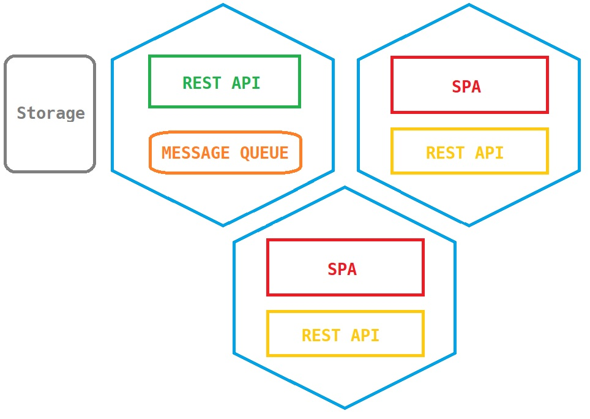

# k8s playground

Simple experiment to discover kubernetes

This project helped me to go through containerization, k8s clusters, k8s deployments, k8s services, k8s volumes and other notions such as pods, replica sets, etc.

This does *not* cover Ingress, Helm and other more advanced topics

## Building blocs

### Overview

The project is made of a consumer and producer.

The publisher is publishing messages to a queue and recording them into his database.

The consumer is made in two parts:

- An API, listening to the queue, keeping track of the message it has read and exposing them through an endpoint
- A frontend, polling both the producer and the consumer API

The overall architecture looks like the following (omitting the services and relations for the sake of simplicity):

### Stack

#### Producer (`backend/`)

- ASP.NET web API
- Entity Framework Core with SQLite for persistance

#### Consumer (`frontend/consumer` & `frontend/consumer-api`)

- Angular 12 SPA
- Python 3.9 with FastAPI

#### Virtualization (`k8s/` and dockerfiles)

- Docker
- docker-compose
- Kubernetes
- minikube for the local cluster

#### Others

- Message queue provided using RabbitMQ
